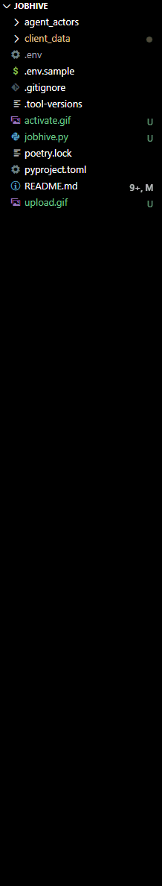

<h1 align="center">🐝 JobHive</h1>

<p>JobHive is an agent-actor system for job search assistance. The system includes several child agents and a parent agent. The child agents are specialized in different areas, such as job search strategy, career coaching, resume writing, interview coaching, and networking. The parent agent acts as a project manager and coordinates the child agents to assist the user in their job search.
</p>

## Table of Contents

- [Table of Contents](#table-of-contents)
- [How Do I Use It?](#how-do-i-use-it)
- [Getting Started](#getting-started)
  - [Prerequisites](#prerequisites)
  - [🔧 Install](#-install)
  - [🏃🏽‍♂️ Run JobHive](#️-run-jobhive)
  - [🌟 Contribute to JobHive 🌟](#-contribute-to-jobhive-)
  - [🔥 Issues 🔥](#-issues-)
  - [🛠 Pull Requests  🛠](#-pull-requests--)
  - [💬 Discussions 💬](#-discussions-)
    - [Project Roadmap](#project-roadmap)
  - [Code of Conduct](#code-of-conduct)
  - [Acknowledgments](#acknowledgments)


## How Do I Use It?
<h4>1️⃣ Upload your resume</p></h4> 


<h4>2️⃣ Activate agent-actors</h4>


<h4>3️⃣ View results</h4>



## Getting Started
### Prerequisites

[Poetry](https://python-poetry.org/docs/), a Python dependency management and packaging tool.

### 🔧 Install
```bash
poetry install --with dev --with typing
```

### 🏃🏽‍♂️ Run JobHive
```bash
poetry run python main.py
```

### 🌟 Contribute to JobHive 🌟

Esteemed collaborators, as we unite to create a monumental project, let us remember the words of Sir Winston Churchill, "Success is not final, failure is not fatal: it is the courage to continue that counts." Embrace our collective wisdom and join our ranks by contributing to this formidable project, following these gallant guidelines:

### 🔥 Issues 🔥

1. **Boldly Raise Your Voice:** Create an issue for any bug or improvement.
2. **Be Specific, Be Fearless:** Provide precise information for the issue.

### 🛠 Pull Requests  🛠

1. **The March of the Brave:** Create a branch from the master, giving it a meaningful name.
2. **Commit with Passion, Push with Purpose:** Keep commits concise and meaningful.

### 💬 Discussions 💬

1. **The Forum of the Fearless:** Engage in discussions, propose ideas, features, or improvements.
2. **Respect, Honor, and Civility:** Treat all participants with the utmost respect.

As we embark on this journey, let us charge forth, united in purpose and fueled by the spirit of collaboration! Together, we shall overcome all adversities and build an awesome agent-actor system for job search assistance! 🚀


#### Project Roadmap
We encourage you to explore the [project roadmap]() to discover potential ways to contribute!

### Code of Conduct
We are building a tool to help people find jobs. As such, it's important people from all walks of life feel welcomed to contribute their time and talents to this project. We expect all contributors to adhere to the [Code of Conduct](CODE_OF_CONDUCT.md). Please read it. Please follow it. Please help us keep this project a safe and welcoming space for everyone.

### Acknowledgments

We would like to express our gratitude to the following projects and their contributors for their inspiration and valuable resources:

- [**LangChain**](https://github.com/hwchase17/langchain): LangChain is an AI-driven natural language to programming language translation platform. It significantly contributed to the development of this project by providing essential tools and resources. We highly appreciate their work and encourage you to check out their project.

- [**Agent-Actors**](https://github.com/shaman-ai/agent-actors): Agent-Actors is a proof-of-concept project inspired by BabyAGI, the Plan-Do-Check-Adjust (PDCA) cycle, and the actor model of concurrency. This project was a stepping stone in the development of our current repository, and we want to acknowledge the ideas and implementation details that have helped shape our work.

Thank you for your contributions and for helping to make this project a reality.


but with some exploration you'll find the agents to be highly customizable. For example, you can change the agent's name, the agent's description the agent's skills, and the agent's personality. You can also add new agents to the system.