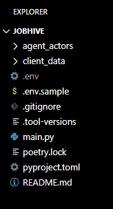
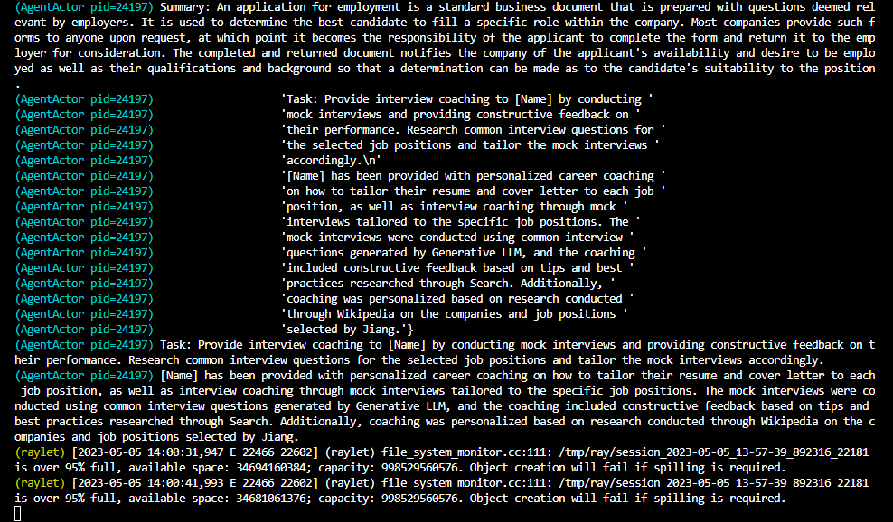

<h1 align="center">🐝 JobHive</h1>

[](https://opensource.org/licenses/MIT) [](https://discord.gg/RByY4Hm66j)


<p>JobHive is an agent-actor system for job search assistance. The system includes several child agents and a parent agent. The child agents are specialized in different areas, such as job search strategy, career coaching, resume writing, interview coaching, and networking. The parent agent acts as a project manager and coordinates the child agents to assist the user in their job search.
</p>
<h5 align="center">


## Table of Contents

- [Table of Contents](#table-of-contents)
- [How Do I Use It?](#how-do-i-use-it)
- [Getting Started](#getting-started)
  - [Prerequisites](#prerequisites)
  - [📥 Clone Repo](#-clone-repo)
  - [🔧 Install](#-install)
  - [🔑 Set Secret API Keys](#-set-secret-api-keys)
  - [📄 Place Resume in `documents` Folder](#-place-resume-in-documents-folder)
  - [🏃🏽‍♂️ Run JobHive](#️-run-jobhive)
- [🌟 Contribute to JobHive 🌟](#-contribute-to-jobhive-)
  - [Improving Agent-Actors](#improving-agent-actors)
  - [🔥 Issues 🔥](#-issues-)
  - [🛠 Pull Requests  🛠](#-pull-requests--)
  - [💬 Discussions 💬](#-discussions-)
- [Code of Conduct](#code-of-conduct)
- [Acknowledgments](#acknowledgments)

## How Do I Use It?
These steps run JobHive after you've completed the initial setup (see: [Getting Started](#getting-started))

<h4>1️⃣ Start FastAPI</p></h4>
```bash
poetry run uvicorn api:app --reload
```

<h4>2️⃣ Upload a resume</p></h4>


Be sure to rename the resume file to `doc.pdf`

<h4>3️⃣ Activate agent-actors</h4>
```bash
curl http://localhost:8000/api/activate
```
You can switch to the server terminal to view agent-actor output in real-time.



<h4>4️⃣ View results</h4>
<h5>Tasks</h5>
```bash
curl http://localhost:8000/api/agent-profiles
```
<h5>Memories</h5>
```bash
curl http://localhost:8000/api/agent-memories
```

I am currently building out the client-side interface that renders the results in a more user-friendly way. An example of rendered output can be viewed [here](rendered_output.pdf). For now, you can view the results in the server terminal using the `curl` commands above.

## Getting Started
### Prerequisites

* [Poetry](https://python-poetry.org/docs/), a Python dependency management and packaging tool.

* Secret API keys for [OpenAI](https://help.openai.com/en/articles/4936850-where-do-i-find-my-secret-api-key), [Serper](https://serper.dev/), [Wolfram Alpha](https://products.wolframalpha.com/simple-api/documentation), and [PromptLayer](https://promptlayer.com/).

### 📥 Clone Repo
```bash
git clone https://github.com/lightshifted/JobHive
```

### 🔧 Install
```bash
poetry install --with dev --with typing
```

### 🔑 Set Secret API Keys
```bash
OPENAI_API_KEY=
SERPER_API_KEY=
WOLFRAM_ALPHA_APPID=
PROMPTLAYER_API_KEY=
```

### 📄 Place Resume in `documents` Folder


Be sure to rename the resume file to `doc.pdf`

### 🏃🏽‍♂️ Run JobHive
```bash
poetry run python jobhive.py
```

## 🌟 Contribute to JobHive 🌟

Thank you for considering contributing to JobHive! Below are some immediate needs that I have identified, but I welcome any contributions that you think could help optimize the project.

### Improving Agent-Actors
- **Prompt tweaks and customization:** We are always looking for ways to improve the output of our agent-actors, and this often involves tweaking and customizing the prompts that they use. If you have experience with natural language generation would like to help us improve our prompts, we would love to hear your suggestions!
- **New LangChain tool integrations:** We are always looking to enhance our agent-actor capabilities by integrating new LangChain tools. If you have experience with natural language processing or machine learning and have ideas for new integrations, we would love to hear from you!
- **LangChain [`StreamingLLMCallbackHandler`](https://blog.langchain.dev/streaming-support-in-langchain/) integration** to send each generated token back to the client via websocket.
- **Agent-Actor Profile Customization:** We are looking to add more customization options for agent-actor profiles through a UI to better match users' needs. If you have experience with front-end development and are interested in helping us improve our customization options, we would love to hear from you!

Thank you again for your interest in contributing to JobHive! If you have any questions or ideas for contributions beyond those listed above, please don't hesitate to reach out in our Discord channel.

### 🔥 Issues 🔥

1. **Boldly Raise Your Voice:** Create an issue for any bug or improvement.
2. **Be Specific, Be Fearless:** Provide precise information for the issue.

### 🛠 Pull Requests  🛠

1. **The March of the Brave:** Create a branch from the master, giving it a meaningful name.
2. **Commit with Passion, Push with Purpose:** Keep commits concise and meaningful.

### 💬 Discussions 💬

1. **The Forum of the Fearless:** Engage in discussions, propose ideas, features, or improvements.
2. **Respect, Honor, and Civility:** Treat all participants with the utmost respect.

As we embark on this journey, let us charge forth, united in purpose and fueled by the spirit of collaboration! Together, we shall overcome all adversities and build an awesome agent-actor system for job search assistance! 🚀


## Code of Conduct
We are building a tool to help people find jobs. As such, it's important people from all walks of life feel welcomed to contribute their time and talents to this project. We expect all contributors to adhere to the [Code of Conduct](CODE_OF_CONDUCT.md). Please read it. Please follow it. Please help us keep this project a safe and welcoming space for everyone.

## Acknowledgments

We would like to express our gratitude to the following projects and their contributors for their inspiration and valuable resources:

- [**LangChain**](https://github.com/hwchase17/langchain): LangChain is an AI-driven natural language to programming language translation platform. It significantly contributed to the development of this project by providing essential tools and resources. We highly appreciate their work and encourage you to check out their project.

- [**Agent-Actors**](https://github.com/shaman-ai/agent-actors): Agent-Actors is a proof-of-concept project inspired by BabyAGI, the Plan-Do-Check-Adjust (PDCA) cycle, and the actor model of concurrency. This project was a stepping stone in the development of our current repository, and we want to acknowledge the ideas and implementation details that have helped shape our work.

Thank you for your contributions and for helping to make this project a reality.


but with some exploration you'll find the agents to be highly customizable. For example, you can change the agent's name, the agent's description the agent's skills, and the agent's personality. You can also add new agents to the system.
