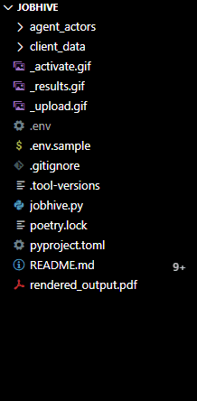

<h1 align="center">JobHive</h1>

<p>JobHive is an agent-actor system for job search assistance. The system includes several child agents and a parent agent. The child agents are specialized in different areas, such as job search strategy, career coaching, resume writing, interview coaching, and networking. The parent agent acts as a project manager and coordinates the child agents to assist the user in their job search.
</p>

## Table of Contents

- [Table of Contents](#table-of-contents)
- [How Do I Use It?](#how-do-i-use-it)
- [Getting Started](#getting-started)
  - [Prerequisites](#prerequisites)
  - [Installation](#installation)
  - [Run JobHive](#run-jobhive)
  - [Contribute to JobHive](#contribute-to-jobhive)
    - [Project Roadmap](#project-roadmap)
    - [Requests for Pull Requests](#requests-for-pull-requests)
  - [Code of Conduct](#code-of-conduct)
  - [Contact](#contact)
  - [Acknowledgments](#acknowledgments)

## How Do I Use It?
<h4>1️⃣ Upload your resume</p></h4> 


<h4>2️⃣ Activate agent-actors</h4>


<h4>3️⃣ View results</h4>




## Getting Started
### Prerequisites

1. Python 3.10.6 or higher
2. Poetry, a Python dependency management and packaging tool: [https://python-poetry.org/docs/](https://python-poetry.org/docs/)

### Installation
Install dependencies
```bash
poetry install --with dev --with typing
```

### Run JobHive

### Contribute to JobHive
#### Project Roadmap
#### Requests for Pull Requests

### Code of Conduct

### Contact

### Acknowledgments

We would like to express our gratitude to the following projects and their contributors for their inspiration and valuable resources:

- [**LangChain**](https://github.com/hwchase17/langchain): LangChain is an AI-driven natural language to programming language translation platform. It significantly contributed to the development of this project by providing essential tools and resources. We highly appreciate their work and encourage you to check out their project.

- [**Agent-Actors**](https://github.com/shaman-ai/agent-actors): Agent-Actors is a proof-of-concept project inspired by BabyAGI, the Plan-Do-Check-Adjust (PDCA) cycle, and the actor model of concurrency. This project was a stepping stone in the development of our current repository, and we want to acknowledge the ideas and implementation details that have helped shape our work.

Thank you for your contributions and for helping to make this project a reality.


but with some exploration you'll find the agents to be highly customizable. For example, you can change the agent's name, the agent's description the agent's skills, and the agent's personality. You can also add new agents to the system.